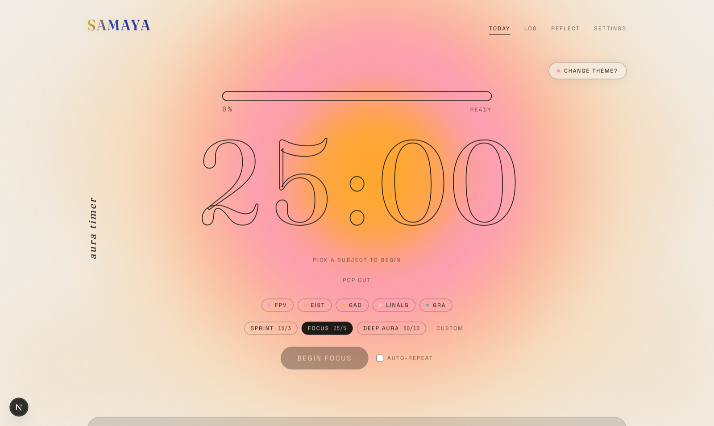
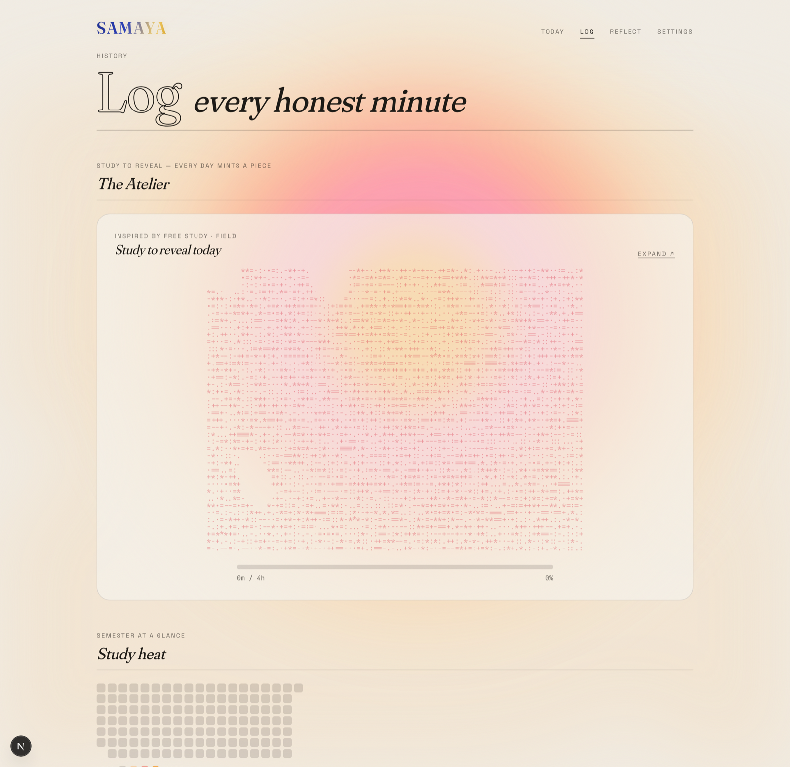
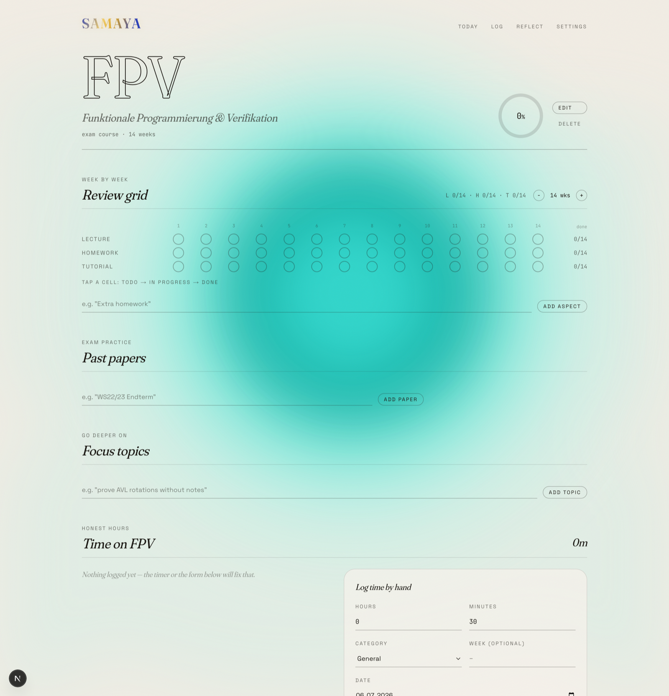
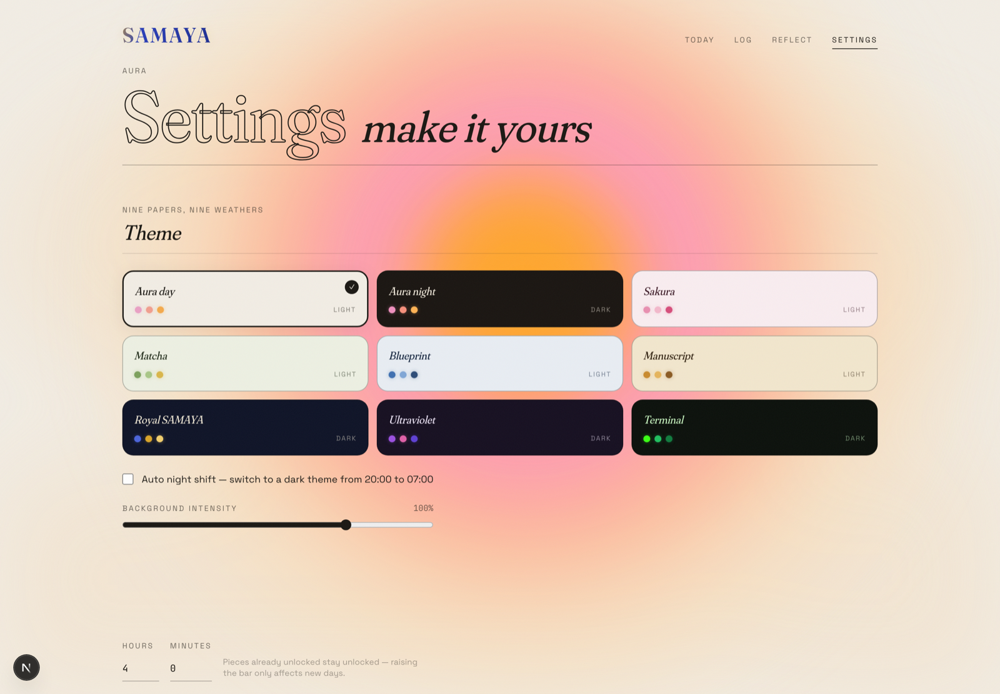
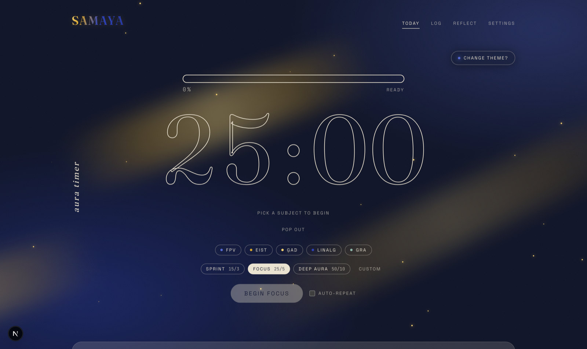
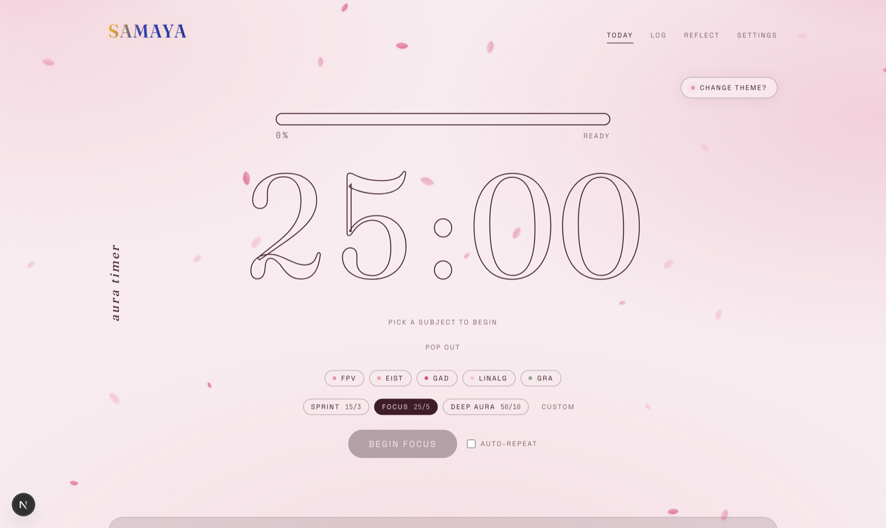
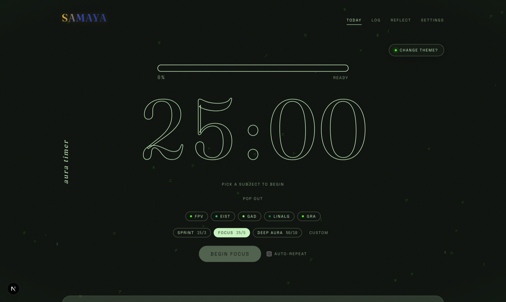
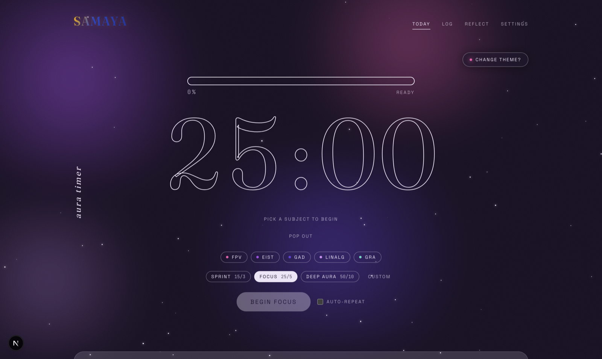
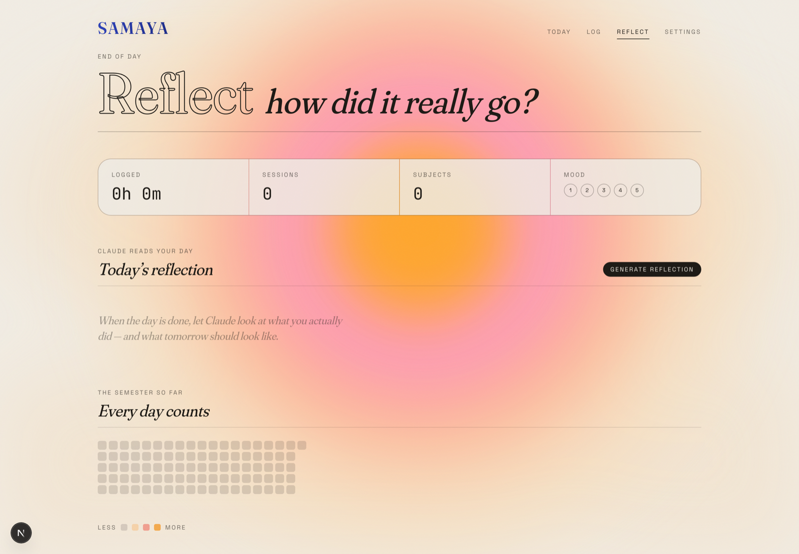

<div align="center">

# ✦ SAMAYA

### *A study platform that feels like a risograph print, not a dashboard.*

Deep per-subject progress · a breathing focus timer · study-to-reveal ASCII art · nine living themes · an honest end-of-day reflection — all **local-first**, all yours.

<br/>



<br/>


</div>

---

## What is this?

**SAMAYA** *(संमय — "time")* is a personal study platform built for a real university semester at TU München. It tracks the actual shape of a semester — week-by-week lecture / homework / tutorial review, past-paper practice, project milestones — runs a focus timer that logs honest study time, and turns each day of effort into a piece of generative art you unlock by studying.

It began as a personal tool. Everything lives on-device (IndexedDB), works fully offline, and costs nothing to run.

> **The rule that shaped it:** *if a screen could belong to any generic SaaS dashboard, it was redone.* Warm cream paper, film grain, outline-only serif digits, a bloom that breathes with your focus. Editorial, analog, calm.

---

## ✦ The signature moves

### The Aura Timer

The hero. Outline-only serif digits (`-webkit-text-stroke`, transparent fill) floating in front of a concentric aurora bloom that **responds to your state** — calm and multi-hued when idle, warmer and pulsing during focus, cooling to sage on a break. Pick a subject, run Sprint / Focus / Deep Aura cycles, and every completed block logs a real session, advances your streak, and rolls an original exam-season quote. There's even a **pop-out floating widget** (Document Picture-in-Picture) you can pin to a corner while you code.

### 🎨 The Atelier — study to reveal

Set a daily target. As your logged minutes climb toward it, a huge ASCII art piece **resolves out of shimmering static, brightest strokes first** — and the art is *math themed to the subject you studied most that day*: escape-time fractals for functional programming, recursive trees for algorithms, Lambert-shaded 3D solids for linear algebra, circuit lattices for computer architecture. Hit your target and the piece **mints** into a per-day gallery, inked in one of 14 palettes. Every day is a one-off.

<div align="center">



</div>

### Per-subject depth

<div align="center">



</div>

Each subject gets its own **cool moving aurora** (turquoise, polar blue, meadow, orchid, glacier), a 3-state weekly review grid that animates as you tick it off, past papers with a hand-built SVG score trend, free-text focus topics, project milestones, manual time logging, and a weighted composite completion — never an arbitrary slider.

### 🌗 Nine living themes

Not just palettes — each theme paints the **whole screen** with its own animated weather. Falling sakura petals, drifting matcha leaves, a blueprint drafting-grid with compass roses, breathing manuscript candlelight, gold silk over royal navy, a synthwave nebula, full-screen Matrix glyph rain. Plus auto day/night by clock and a background-intensity slider.

<div align="center">



<table>
<tr>
<td></td>
<td></td>
</tr>
<tr>
<td align="center"><em>Royal SAMAYA — gold silk over navy</em></td>
<td align="center"><em>Sakura — falling blossom</em></td>
</tr>
<tr>
<td></td>
<td></td>
</tr>
<tr>
<td align="center"><em>Terminal — live glyph rain</em></td>
<td align="center"><em>Ultraviolet — drifting nebula</em></td>
</tr>
</table>

</div>

### End-of-day reflection

<div align="center">



</div>

At day's end, an AI reads what you actually did — sessions, subjects touched, and outstanding work *weighted by exam proximity* — and writes a short, honest three-part reflection with a prioritised plan for tomorrow. No empty hype. Powered by **Google Gemini's free tier**, so it costs nothing. The rest of the app works perfectly without it.

---

## ✦ Design language

| | |
|---|---|
| **Paper & ink** | Warm cream `#F2EDE4`, near-black warm charcoal, film grain via SVG `feTurbulence` |
| **Aura hues** | pink → coral → orange → peach, with a sage accent for "done" states |
| **Type** | **Fraunces** (variable, soft optical display serif) · **Space Grotesk** (UI) · **JetBrains Mono** (data) |
| **Motion** | Layout-animated grids, digit roll transitions, spring micro-interactions, route cross-fades — deliberate, never sprinkled |
| **Signature** | The bloom that breathes with your focus + the outlined serif clock |

Everything derives from a token system, so a new theme is one CSS block plus a swatch. `prefers-reduced-motion` freezes every animation while keeping the color.

---

## ✦ Tech

**Next.js** (App Router) · **TypeScript** (strict) · **Tailwind CSS v4** · [`motion`](https://motion.dev) · **Zustand** + **IndexedDB** (`idb-keyval`, behind a repository seam for future sync) · **Google Gemini** free tier for reflections · **date-fns** · hand-built SVG charts and procedural ASCII generators — no charting library, no AI-drawn art.

---

## ✦ Run it

```bash
npm install
cp .env.example .env.local      # optional — see below
npm run dev                     # → http://localhost:3000
```

**Reflections (optional, free):** grab a key from [Google AI Studio](https://aistudio.google.com), then put `GEMINI_API_KEY=…` in `.env.local`. Deploying on Vercel? Add the same variable under **Project → Settings → Environment Variables** and redeploy. Everything else works without any key.

Your data lives in your browser (IndexedDB) — **Settings → Export / Import JSON** is the safety net for moving between machines.

---

## ✦ Notes

- **Local-first by design.** No account, no server-side database, fully offline. Cloud sync is an optional future milestone — the persistence layer is already a swappable adapter.
- Architecture choices are documented in **[DECISIONS.md](DECISIONS.md)**.
- Accessible baseline: visible keyboard focus, semantic HTML, labelled controls, reduced-motion respected.

<div align="center">
<br/>
<sub>Built with care as a portfolio piece — and used daily during exam season.</sub>
</div>
