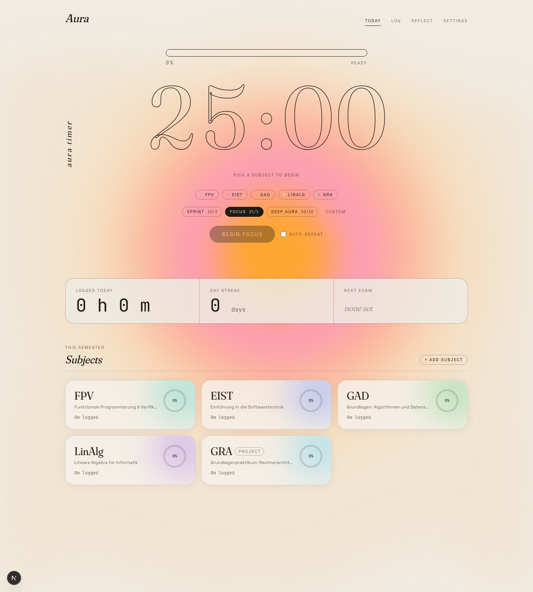
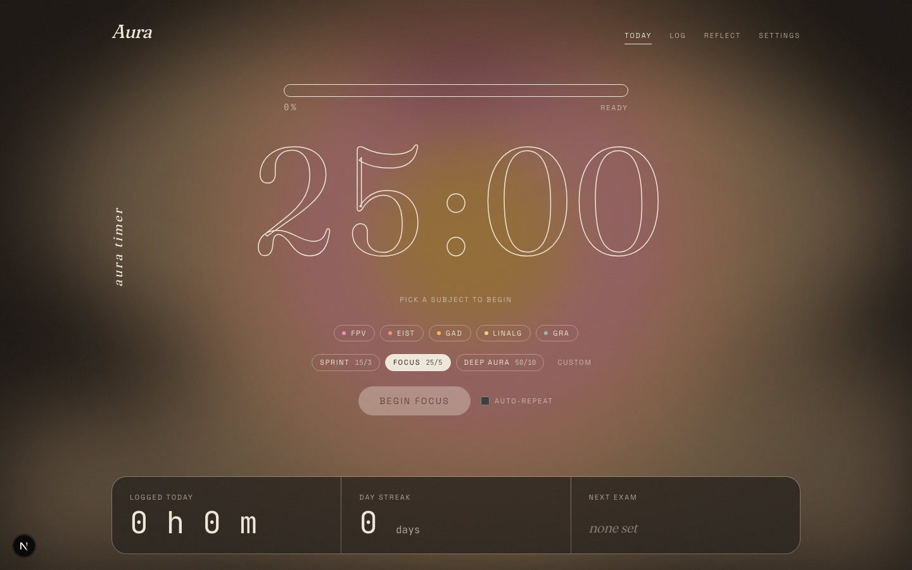
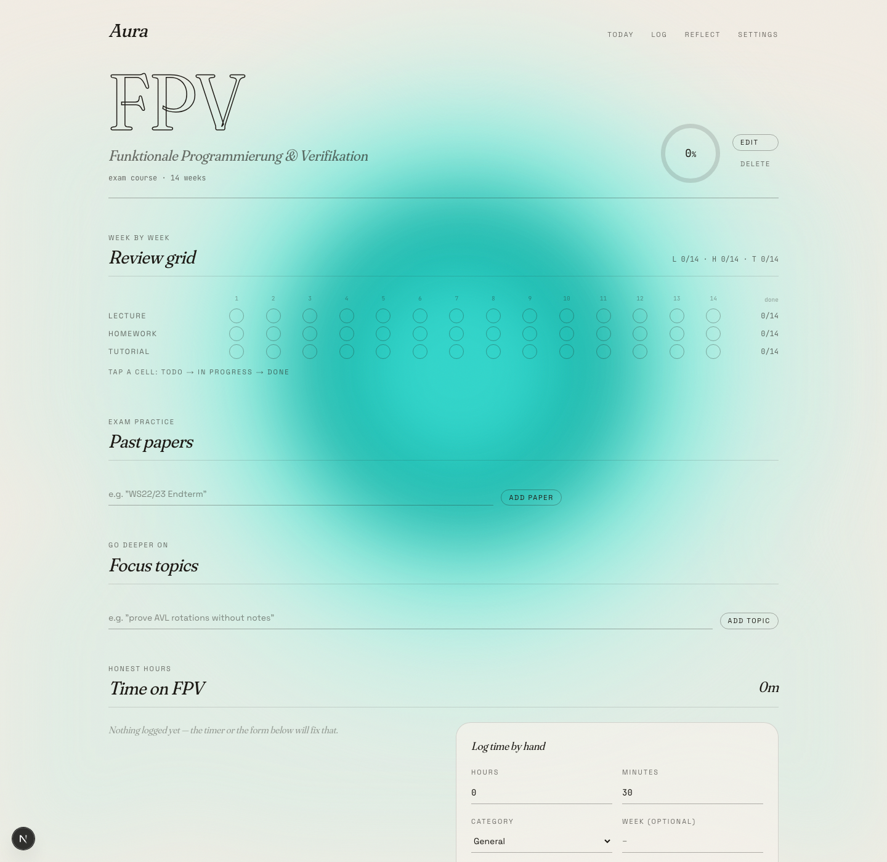
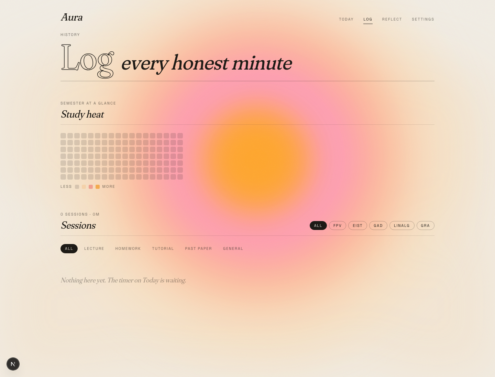

# Aura — personal study platform

A local-first study tracker built for a real TUM Informatik semester: deep per-subject progress (week-by-week lecture / homework / tutorial review and past-paper practice), a focus timer that logs honest study time, and an AI end-of-day reflection.



## What it does

- **Aura Timer** — an outlined-serif clock in front of a breathing aurora bloom. Pick a subject (and optionally category + week), run focus/break cycles (Sprint 15/3 · Focus 25/5 · Deep Aura 50/10 · custom), and every completed block lands as a real logged session. The bloom warms and pulses while you focus, cools to sage on breaks, and each completed block rolls an original exam-season quote.
- **Per-subject tracking** — a 3-state weekly review grid (todo → in progress → done) per track, past papers with a score trend, free-text focus topics, and a weighted composite completion (weekly tracks 70% / past papers 30%). Project courses (GRA) track milestones instead.
- **Log & heatmap** — every session, filterable by subject and category, plus a semester heatmap of study minutes.
- **Reflection** — Claude reads your day (sessions, subjects touched, outstanding work weighted by exam proximity) and writes a short honest reflection with a prioritised plan for tomorrow. Stored in your daily log.
- **Local-first** — everything persists to IndexedDB on-device; JSON export/import is the safety net. No account, works offline (only the reflection needs a network + API key).



Every subject page has its own moving aurora — cool turquoise, polar blue, meadow green, orchid, glacier — while the timer keeps the warm reference palette:




## Stack

Next.js (App Router) · TypeScript (strict) · Tailwind CSS v4 · [`motion`](https://motion.dev) · Zustand + IndexedDB (`idb-keyval`) · `@anthropic-ai/sdk` · `date-fns` · hand-built SVG charts

## Run it

```bash
npm install
cp .env.example .env.local   # optional: add ANTHROPIC_API_KEY for reflections
npm run dev
```

The app is fully usable without the key — only the AI reflection is disabled.

## Design notes

The north star is a risograph-style reference: warm cream paper with film grain, a concentric aurora bloom (orange core → pink → coral → peach wash), huge outline-only Fraunces digits (`-webkit-text-stroke`, transparent fill), a thin pill progress bar and a vertical serif label. Three typographic voices carry the identity: Fraunces (display, soft optical axis), Space Grotesk (UI), JetBrains Mono (data). The bloom is state-driven — palette and motion energy respond to the timer — and each subject overrides it with its own cool aurora. A 21st.dev "Etheral Shadow" component (re-themed, self-contained) adds a slow undulating wash underneath. `prefers-reduced-motion` freezes all drift but keeps the color. Night theme swaps the paper to deep warm brown-black and lets the aura glow.

Architecture decisions are documented in [DECISIONS.md](DECISIONS.md).
